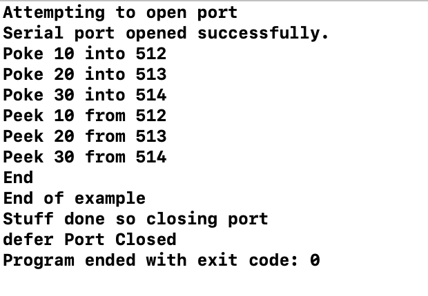
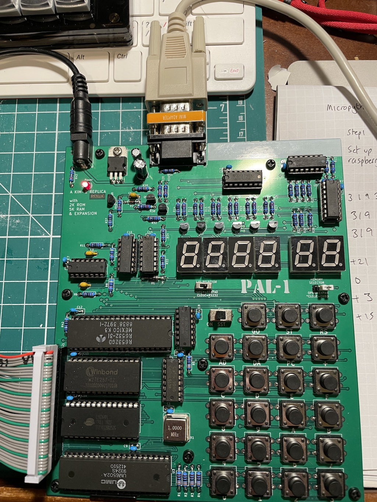
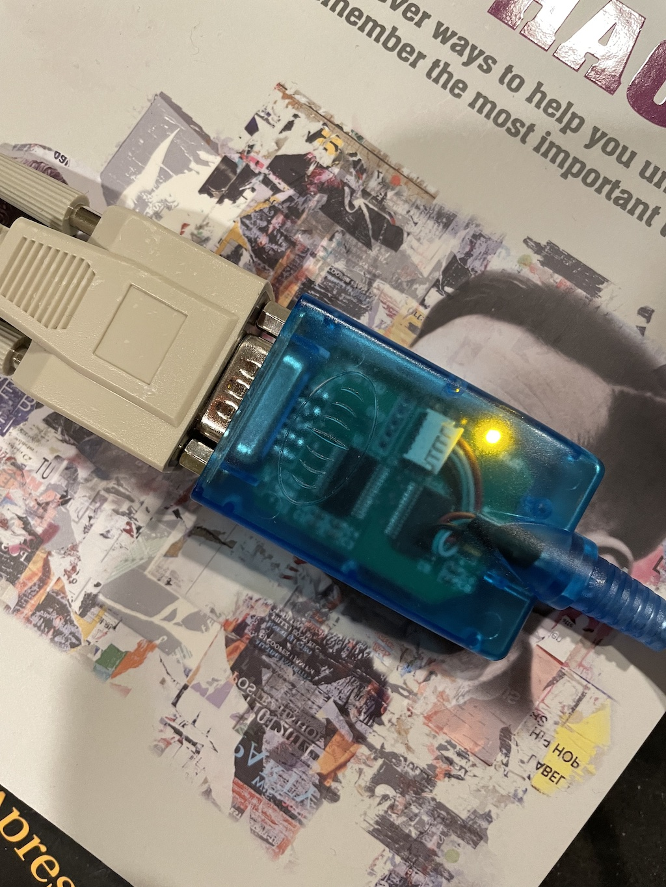

# Retroshield experiment

The [Retroshield](http://www.8bitforce.com/projects/retroshield/) is a piece of hardware and software that lets you use a real vintage CPU with an Arduino providing an emulation of RAM, ROM, clock and control signals.

It's the ideal way to use a real CPU without the hassle of sourcing and building the rest of the computer.

As I worked on the 6502 emulation part of the Virtual Kim project, I kept thinking it would be great to find a way to automate testing the opcode implementation code against a *real* 6502.

This is a project where I try to do that - by using a Retroshield with a real 6502, connected to the computer running the 6502 emulation I wrote, I hope to run code side-by-side on a virtual and a real 6502 and check for discrepencies.

To do this, I need to write some Swift code that can communicate with the Retroshield - it connects over the Arduino's USB port by default. I also need to write some code on the Retroshield 'rom' that listens for commands from the serial port, takes an instruction, executes it, and then responds with the 6502 status (registers, flags, and maybe zero page or full memory map?).

I'll start by taking the [KIM-1 Retroshield code](https://gitlab.com/8bitforce/retroshield-arduino/-/tree/master/k6502/k65c02_kim1) (as I know the KIM-1 now pretty well) and adapting that.

## Monday 22, Feb 2021

* I have gotten a Mac program to read/write to the serial port.

* I have gotten the Retroshield 6502 system to run my code on launch.

* Need to write 6502 to wait for three bytes, treat them as opcodes, execute them, and report results.

## Sunday 7, Mar 2021

I had some other ideas, including trying to load Tiny and Microsoft BASIC and other apps onto the KIM-1 emulation that is part of the Retroshield distribution. I figured if I could run the same code on the 6502 on the Retroshield, that would be a good benchmark. Sadly nothing I loaded (and this was using the L command on the KIM-1 which loaded 'paper tape' files) would run properly. I thought it might be a timing issue, as the Arduino based Retroshield is a little slow, so I moved over to the Teensy compatible RetroShield I had - and after installing all the tools, I realized that there was no KIM-1 emulator for the Teensy system yet: and worse, the KIM-1 emulation for the Arduino shield was marked as "not tested" which explained why it wouldn't run any KIM-1 apps. Oh well!

Then, as I was brushing my teeth, I had an idea which was completely obvious in retrospect and absolutely what I should have been doing from the beginning. The PAL-1 system I have - which does run **everything** a real KIM-1 can run because it's almost the same hardware, and so it's the Gold Standard - has a serial port. And the serial port is the standard KIM-1 serial port which means it accepts instructions such as setting bytes and reading status. 

What I *should* be doing is using my virtual 6502 program to send commands to the PAL-1's serial terminal, executing the same instruction as the virtual system, and looking at the status flags on both. Side-by-side the virtual and PAL-1 systems should be able to run code and compare results. It won't necessarily look at the system memory at this stage (it'll take a while to copy over a memory snapshot at the PAL-1's slow bitrate) but it's a start. And thanks to the new [PAL-1 expansion system](https://www.tindie.com/products/tkoak/pal-1-motherboard-expansion-kit/) if I do need more speed I'll bet I could build something.

Of course I had this idea quite late on Sunday evening, which is frustrating!

## Monday 8, Mar 2021

Timing is everything! And I mean that in the sense that adjusting delays betweet serial reads and writes over a slow (1200 bps) link between my Mac and a PAL-1 is crucial to getting things to work. But as of now, the Mac can send Peek and Poke commands to the PAL-1 over serial, and it works! It's excrutiatingly slow, but it works!



Here's the set up:

* The Mac has a serial to USB dongle connected.
* The dongle connects via a serial cable to the PAL-1 on the other side of the room
* The PAL-1 is in terminal mode
* The Mac sends strings like '0200<space>' to the PAL-1, and the PAL-1 sends back the response.
* The Mac filters out all the NULLs that the PAL-1 likes to add.





Here's the code:

```
import Foundation


let serialPort: SerialPort = SerialPort(path: "/dev/cu.usbserial-AC00I4ST")


do {

    print("Attempting to open port")
    try serialPort.openPort()
    print("Serial port opened successfully.")
    defer {
        
        print("Stuff done so closing port")
        serialPort.closePort()
        print("defer Port Closed")
    }

    serialPort.setSettings(receiveRate: .baud1200,
                           transmitRate: .baud1200,
                           minimumBytesToRead: 1)
    usleep(200000)
    
    // Poke in the new values
    
    Poke(address: 0x200, value: 10)
    Poke(address: 0x201, value: 20)
    Poke(address: 0x202, value: 30)
    
    // Peek them back out to confirm
    
    _ = Peek(address: 0x0200)
    usleep(200000)
    _ = Peek(address: 0x0201)
    usleep(200000)
    _ = Peek(address: 0x0202)
    usleep(200000)
   
    print("End")
   
} catch PortError.failedToOpen {
    print("Serial port failed to open. You might need root permissions.")
} catch {
    print("Error: \(error)")
}


func Poke(address : UInt16, value : UInt8)
{
    // Send address, space
    // Send value, .
    
    print("Poke \(value) into \(address)");
    
    do {
        
    let addr = String(format: "%04X", address).map { String($0) }
    let byte = String(format: "%02X", value).map { String($0) }
        
       
        _ = try serialPort.writeString(addr[0]) ; usleep(100000)
        _ = try serialPort.writeString(addr[1]) ; usleep(100000)
        _ = try serialPort.writeString(addr[2]) ; usleep(100000)
        _ = try serialPort.writeString(addr[3]) ; usleep(100000)
        _ = try serialPort.writeString(" ") ; usleep(200000)
        
        let _ = try serialPort.readString(ofLength: 21)
        
        _ = try serialPort.writeString(byte[0]) ; usleep(100000)
        _ = try serialPort.writeString(byte[1]) ; usleep(100000)
        _ = try serialPort.writeString(".") ; usleep(200000)
        

       let _ = try serialPort.readString(ofLength: 19)
        
        usleep(200000)
         
    }  catch {
        print("Error: \(error)")
    }
    
}


func Peek(address : UInt16) -> UInt8
{
    
    var dec : UInt8 = 0
    
    do {
        
    let addr = String(format: "%04X", address).map { String($0) }
        
       
        _ = try serialPort.writeString(addr[0]) ; usleep(100000)
        _ = try serialPort.writeString(addr[1]) ; usleep(100000)
        _ = try serialPort.writeString(addr[2]) ; usleep(100000)
        _ = try serialPort.writeString(addr[3]) ; usleep(100000)
        _ = try serialPort.writeString(" ") ;
        
        
        let s = try serialPort.readString(ofLength: 21)
        
        let parts = s.components(separatedBy: " ")
        
      
         dec = UInt8(parts[2], radix: 16)!
              
    }  catch {
        print("Error: \(error)")
    }
    
    print("Peek \(dec) from \(address)");
    
    
    return dec
}


```

## Next step

Now that I can send over memory and read it back, I just need to send a G command. That means I can poke in the assembly instructions, execute the code, and then read the status of the flags. Thanks to the way the KIM works, the status of the flags and registers are mirrored in some zero page addresses.